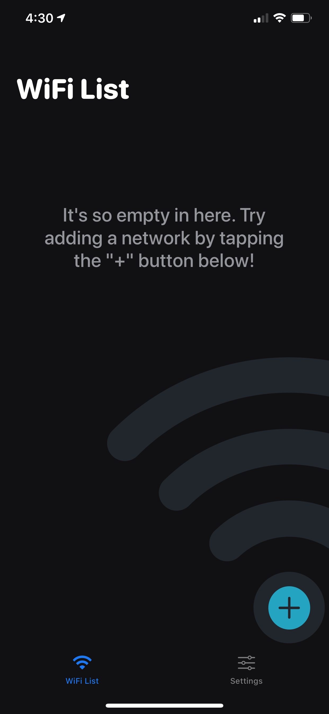
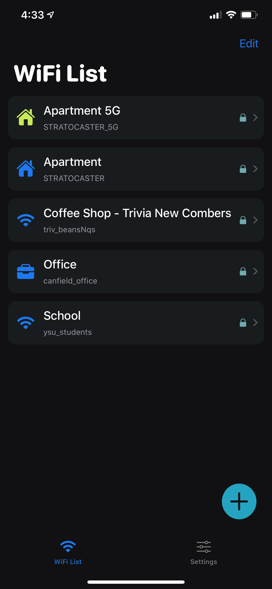
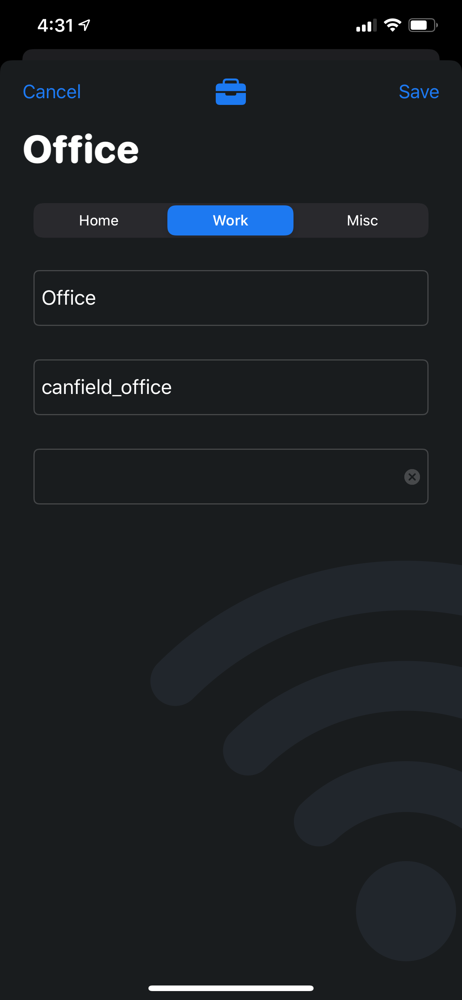
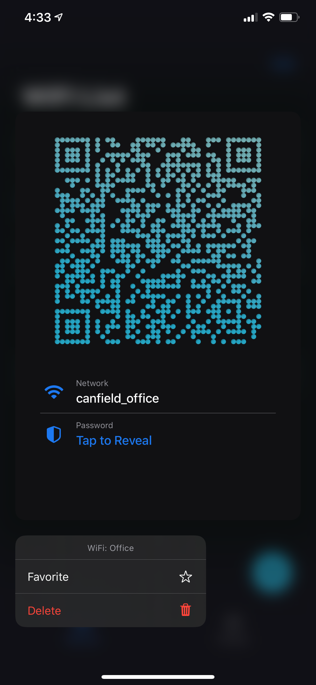
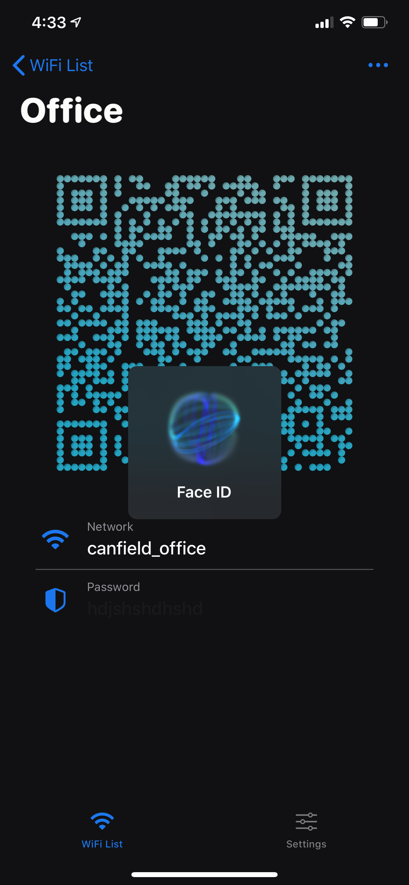
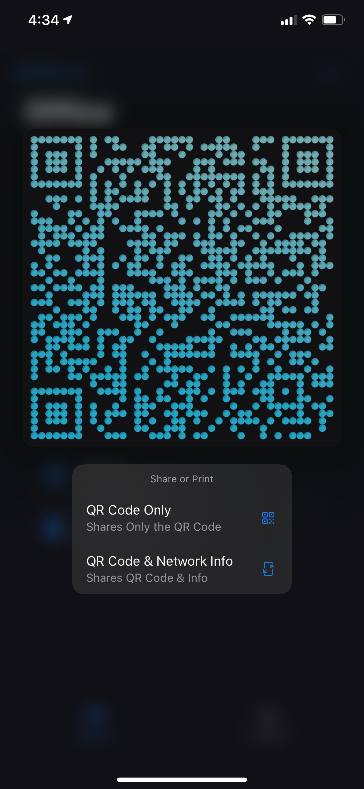
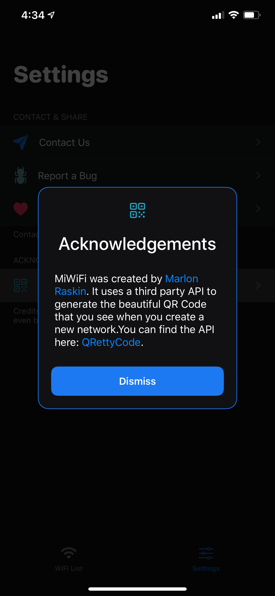
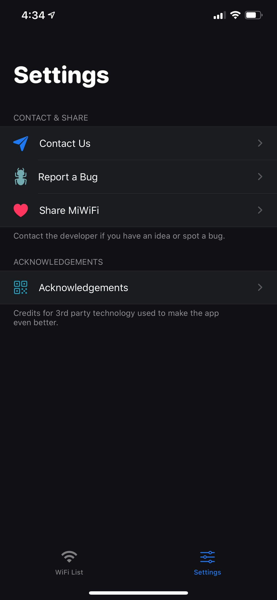

# MiWiFi
---
MiWiFi is an app that let's you add any WiFi network and it's credentials and will generate a QR code for you using the [QRettyCode](https://github.com/mredig/QRettyCode) framework. This makes it much easier to allow people to join your wifi network without revealing your password. All passwords are stored securely in Keychain.
---

### Why?
This app is a side project while I am still attending Lambda. I made it 100% programmatically. I wanted the experience of building an iOS app without using a single storyboard to gain more knowledge about UIKit.

### FF (Future Features)
- CloudKit Support
- CoreLocation - Brings the most relevant (based on your location) WiFi network to the top of the list
- Custom QR Code theme selection for user
- iPad AutoLayout support. Currently it adapts to all iPhone sizes.

## Screenshots
---
 
 
 
 
